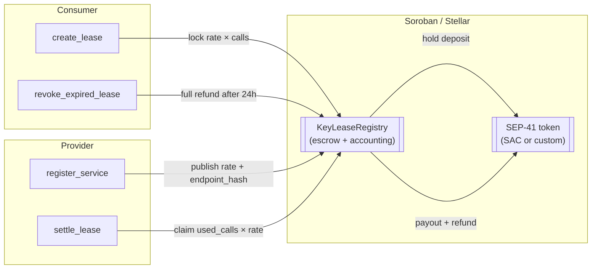

# keylease-core

> **Time-bound, ephemeral micro-leases for API & RPC providers on Stellar/Soroban.**
> Lock a micropayment in escrow, receive a cryptographic authorization, and never
> hand a developer a leaked static credential again.

[](https://github.com/KeyLease-Security/keylease-core/actions/workflows/ci.yml)
[](./LICENSE)
[](https://www.rust-lang.org)
[](https://crates.io/crates/soroban-sdk)

---

## Why KeyLease

Static API keys are a liability: they leak, they never expire, and they can't be
metered on-chain. KeyLease replaces them with **leases** — short-lived, on-chain
authorizations backed by an escrowed micropayment.

- **No leaked credentials.** Providers publish a commitment (`endpoint_hash`)
  instead of a secret. Authorization is proven on-chain, per lease.
- **Pay for what you use.** The deposit is `rate_per_call × requested_calls`.
  Unused balance is refunded automatically at settlement.
- **No stranded funds.** If a provider goes offline, the consumer reclaims the
  **entire** deposit 24 hours after expiry — no support ticket required.
- **Cheap to verify.** Providers settle once per lease with a single call count.

---

## Architecture



```text
keylease-core/
├── contracts/
│   ├── registry/          # the protocol: services, leases, escrow, settlement
│   │   ├── src/
│   │   │   ├── lib.rs     # entry points + lifecycle docs
│   │   │   ├── types.rs   # Service, Lease, LeaseStatus
│   │   │   ├── storage.rs # DataKey layout + TTL policy
│   │   │   ├── errors.rs  # stable error codes
│   │   │   └── test.rs    # full lifecycle + adversarial tests
│   │   └── Cargo.toml
│   └── mock_token/        # minimal SEP-41 token for tests & local sandboxes
└── Cargo.toml             # workspace
```

---

## Contract interface

### `KeyLeaseRegistry`

| Entry point | Auth | Description |
| --- | --- | --- |
| `init(admin)` | `admin` | One-time initialization; appoints the protocol admin. |
| `set_token(admin, token)` | `admin` | Configure the SEP-41 escrow token. |
| `register_service(provider, rate_per_call, endpoint_hash) -> u64` | `provider` | Publish a leasable service. Returns `service_id`. |
| `set_service_active(provider, service_id, is_active)` | `provider` | Pause/resume new leases for a service. |
| `create_lease(consumer, service_id, requested_calls, duration_secs) -> u64` | `consumer` | Lock `rate × calls` and mint a lease. Returns `lease_id`. |
| `settle_lease(provider, lease_id, verified_calls)` | `provider` | Pay the provider, refund the remainder to the consumer. |
| `revoke_expired_lease(consumer, lease_id)` | `consumer` | Reclaim the full deposit 24h after expiry. |
| `get_admin()`, `get_token()`, `get_service(id)`, `get_lease(id)` | — | Read-only views. |
| `lease_status(id)`, `remaining_calls(id)`, `locked_balance(id)` | — | Derived lifecycle queries. |

### Lifecycle

```
Active ──(expires_at reached)──▶ Expired ──(24h grace)──▶ revocable by consumer
   │                                  │
   └──(fully consumed)────────────────┴──(provider settles)──▶ Settled
```

A lease is **settleable** when it has expired **or** `verified_calls ==
allocated_calls`. It is **revocable** only when expired **and** the 24-hour
provider grace window has elapsed. Either path ends in `Settled`; a settled
lease can never be settled or revoked again.

---

## Quickstart

```bash
# 1. Toolchain (Rust 1.84+; wasm32v1-none target for Soroban)
rustup target add wasm32v1-none

# 2. Build & test the workspace
cargo test --all

# 3. Lint the way CI does
cargo fmt --all -- --check
cargo clippy --all-targets -- -D warnings

# 4. Produce deployable Soroban WASM
cargo build --target wasm32v1-none --release --all
# → target/wasm32v1-none/release/keylease_registry.wasm
# → target/wasm32v1-none/release/keylease_mock_token.wasm
```

### Local sandbox (Stellar CLI)

```bash
stellar contract deploy \
  --wasm target/wasm32v1-none/release/keylease_registry.wasm \
  --source <your-account> \
  --network testnet
```

Then initialize and publish a service:

```bash
stellar contract invoke --id $REGISTRY --network testnet --source <admin> \
  -- init --admin <ADMIN>

stellar contract invoke --id $REGISTRY --network testnet --source <admin> \
  -- set_token --admin <ADMIN> --token <SAC_OR_TOKEN_ADDRESS>

stellar contract invoke --id $REGISTRY --network testnet --source <provider> \
  -- register_service \
     --provider <PROVIDER> \
     --rate_per_call 100 \
     --endpoint_hash 0707070707070707070707070707070707070707070707070707070707070707
```

---

## Security model

KeyLease escrows funds, so the contract is written to a small, auditable set of
invariants:

1. **Checked arithmetic everywhere.** Deposit (`rate × calls`) and payout math
   use `checked_mul`/`checked_add`; overflow aborts the transaction instead of
   minting a cheap lease or a truncated refund. See `test_rate_math_overflow_reverts_deposit`.
2. **No double settlement.** `settled` is set before any payout is recorded as
   complete, and every money-moving path checks it first
   (`LeaseAlreadySettled`).
3. **Bounded provider claims.** A provider can never withdraw more than
   `allocated_calls × rate_per_call`, and only for leases it owns
   (`InvalidCalls`, `Unauthorized`).
4. **Guaranteed consumer exit.** A provider that never settles cannot strand
   funds: after expiry + 24h the consumer reclaims the full deposit.
5. **Explicit authorization.** Every state-changing entry point calls
   `require_auth()` on the actor it claims to represent, and cross-checks that
   actor against stored ownership where relevant.

### Trusting the escrow token

The registry uses a standard SEP-41 `transfer`/`balance` interface, so it works
with the native Stellar Asset Contract or a custom token. The token is set by
the admin via `set_token`. The admin **cannot** move escrowed funds; it can only
point the registry at a token address.

> `contracts/mock_token` is a **test/sandbox-only** token with an unlimited
> mint. It must never be deployed to a network holding real value.

---

## Testing

```bash
cargo test --all
```

The suite in `contracts/registry/src/test.rs` covers:

- service registration and ID monotonicity,
- the happy path (lock → full-usage settle before expiry),
- partial settlement after expiry with correct refund,
- expired, unsettled leases being fully reclaimed by the consumer,
- the 24-hour grace window (boundary, early-settle, and post-settle cases),
- unauthorized settle/revoke attempts,
- rate-math and timestamp overflow reverts,
- status transitions and derived views.

---

## Contributing

See [CONTRIBUTING.md](./CONTRIBUTING.md). Drips Wave tasks are filed from the
templates in `.github/ISSUE_TEMPLATE/`
(`trivial 100 pts`, `medium 150 pts`, `high 200 pts`).

## License

[MIT](./LICENSE) © 2026 KeyLease Security
