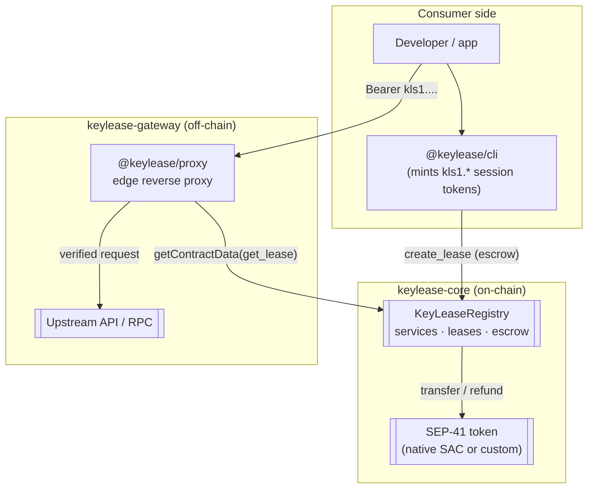
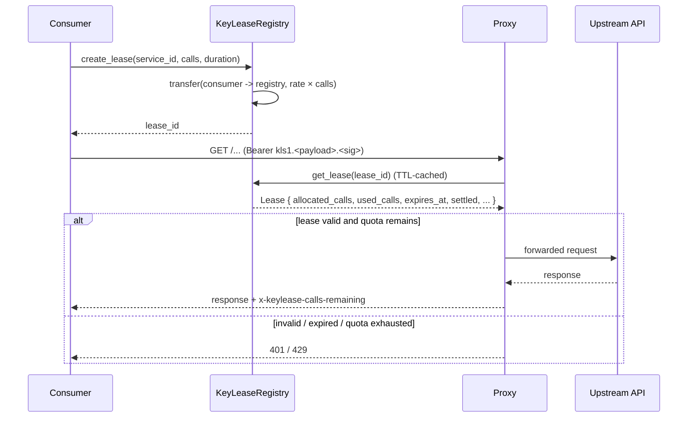

# Architecture

KeyLease is two repositories with a clean split of responsibility: the contract
owns **truth and money**, the gateway owns **enforcement and ergonomics**.

## Components



### keylease-core (this repository)

A pure Rust Soroban workspace. It is the only component that can move value.

| Piece | Role |
| --- | --- |
| `KeyLeaseRegistry` | Services, leases, escrow, settlement, refunds. |
| `MockToken` | A minimal SEP-41 token for tests and sandboxes. Never deploy it to a network holding value. |

The registry is deliberately small. It does not know what an HTTP request is,
what the endpoint does, or who is calling it. It knows `service_id`,
`allocated_calls`, `expires_at` and `locked_deposit`.

### keylease-gateway

TypeScript. It cannot move escrowed value, and it is not the source of truth.

| Piece | Role |
| --- | --- |
| `@keylease/cli` | Acquires leases, stores sessions, mints session tokens, prints status. |
| `@keylease/proxy` | Verifies a session token, reads the lease from Soroban, enforces the quota, forwards the request. |

## Why the split

**The contract must be minimal.** Every line of on-chain code is attack surface
for escrowed funds. `endpoint_hash` is a commitment precisely so the contract
never has to reason about off-chain credentials.

**The gateway must be replaceable.** A provider can run their own proxy, write
their own in-process middleware, or ignore the proxy entirely and verify leases
themselves. The protocol does not depend on the gateway being alive: if the
proxy is down, providers can still settle, and consumers can still revoke.

**Trust flows one way.** The gateway trusts the contract for lease state. The
contract trusts nobody: every mutating entry point authenticates the actor it
claims to represent, and the consumer always has an exit.

## Data flow: one metered call



## Off-chain authorization is a cache, not a ledger

The proxy's local call counter is an optimisation, not the source of truth. The
lease's `allocated_calls` and `expires_at`, held on-chain, bound what any proxy
will allow. A tampered proxy can only cheat *itself* — the provider still settles
for at most `allocated_calls × rate_per_call` on-chain.

## Repository layout

```text
keylease-core/
├── contracts/
│   ├── registry/          # the protocol
│   │   ├── src/lib.rs     # entry points + lifecycle docs
│   │   ├── src/types.rs   # Service, Lease, LeaseStatus
│   │   ├── src/storage.rs # DataKey layout + TTL policy
│   │   ├── src/errors.rs  # stable error codes
│   │   └── src/test.rs    # lifecycle + adversarial tests
│   └── mock_token/        # test-only SEP-41 token
├── scripts/               # deploy, issue generation, repo setup
├── docs/                  # this documentation
└── Cargo.toml             # workspace
```

## Read next

- [How the protocol works](protocol.md) — the state machine and worked economics.
- [Hosting topology](hosting-topology.md) — where each process runs in production.
