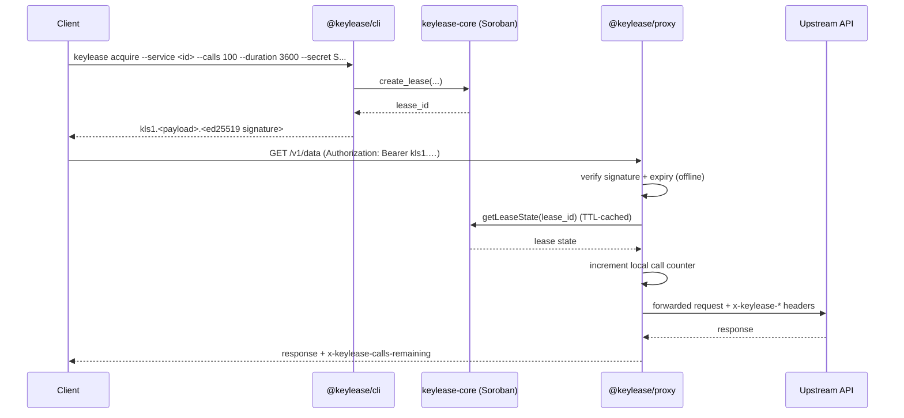

# Gateway

> **Repository:** [keylease-gateway](https://github.com/KeyLease-Security/keylease-gateway) — the TypeScript CLI and edge proxy.

`keylease-gateway` is the off-chain half of KeyLease. It cannot move escrowed
value and it is not the source of truth; it turns an on-chain lease into a
bearer credential a developer can use and a check a provider can enforce.

```
packages/cli    →  @keylease/cli     keylease acquire / env / status
packages/proxy  →  @keylease/proxy   lease-verifying reverse proxy
```

| Piece | Package | Role |
| --- | --- | --- |
| CLI | `@keylease/cli` | Acquires leases, stores sessions, mints `kls1.*` bearer tokens, prints status. |
| Proxy | `@keylease/proxy` | Verifies a session token, reads the lease from Soroban, enforces the quota, forwards the request. |

For how these pieces divide responsibility with the contract, see
[Architecture](../architecture.md). The split is deliberate: the contract owns
**truth and money**, the gateway owns **enforcement and ergonomics**.

## How a call flows



Three properties shape the design:

- **The signature check is offline.** A bearer token is
  `kls1.<base64url(payload)>.<ed25519 signature>`, signed by the consumer's
  Stellar key. Forged or expired tokens never reach the RPC layer. See
  [Session tokens](session-tokens.md).
- **The lease check is on chain, but cached.** The proxy reads lease state over
  Soroban RPC and caches it for a short TTL so a busy proxy makes far fewer RPC
  calls than it handles requests.
- **Quota is enforced locally per proxy.** Each allowed request increments an
  in-memory counter; the lease is refused once the quota is spent. The on-chain
  `allocated_calls` and `expires_at` are the real bound, so a tampered counter
  can only make the provider charge *less*, never more.

## Quickstart

```bash
pnpm install
pnpm build

# 1. acquire a lease (needs a funded account + a deployed keylease-core)
export KEYLEASE_CONTRACT_ID=C...
keylease acquire --service 1 --calls 100 --duration 3600 --secret "$STELLAR_SECRET"

# 2. drop the session keys into ./.env
keylease env --service 1

# 3. run the proxy in front of the protected API
export KEYLEASE_UPSTREAM_URL=https://api.example.com
pnpm --filter @keylease/proxy start

# 4. call through it
curl -H "Authorization: Bearer $KEYLEASE_SESSION_TOKEN" \
  http://localhost:8080/v1/weather
```

Offline sanity check of a token (no RPC required):

```bash
keylease status --token "$KEYLEASE_SESSION_TOKEN"
```

The `@keylease` packages are not published to npm yet, so the supported install
path is from source at [keylease-gateway](https://github.com/KeyLease-Security/keylease-gateway#development).

## Repository layout

```text
keylease-gateway/
├── packages/
│   ├── cli/       # @keylease/cli  — index, token, commands/{lease,status}, client/soroban
│   └── proxy/     # @keylease/proxy — index, server, verifier, cache
├── scripts/       # batch Wave backlog creation
├── pnpm-workspace.yaml
└── tsconfig.base.json
```

## Contract interface

The CLI invokes the registry over Soroban RPC and the proxy reads lease state
from it. The registry ABI is authoritative in the
[contract reference](../contract-reference.md) — a gateway build only works
against the contract revision its client was written for, so keep the two in
sync when either changes. Deployment addresses are in
[Deployments](../deployments.md).

## Read next

- [CLI reference](cli.md) — every command and flag.
- [Proxy](proxy.md) — configuration, verification pipeline and responses.
- [Session tokens](session-tokens.md) — the `kls1.*` format and error codes.
