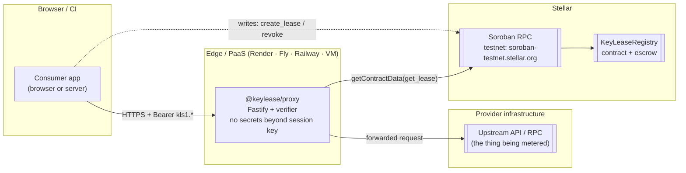

# Hosting topology

Which processes run where, which endpoints they talk to, and which of them hold
value. Nothing here moves funds except the contract.

## The picture

## Components and where they run

| Component | Runtime | Where | Holds value |
| --- | --- | --- | --- |
| `KeyLeaseRegistry` | Soroban Wasm | Stellar ledger | ✅ escrow |
| `@keylease/proxy` | Node 20+ | Render / Fly / Railway / a VM | ❌ |
| `@keylease/cli` | Node 20+ | developer machine or CI | ❌ (holds keys) |
| Consumer app | any | browser or server | ❌ (holds a session token) |
| Upstream API | provider's choice | provider infrastructure | ❌ |

The **contract is the only component holding value**. The proxy cannot move
escrow; the CLI cannot move escrow; the session token cannot move escrow.

## Request path, end to end

1. The consumer app sends `Authorization: Bearer kls1.<payload>.<sig>` to the
   proxy.
2. The proxy verifies the signature with `KEYLEASE_SESSION_SECRET`, then reads
   the lease from Soroban RPC (`getContractData` on `Vec[Symbol("Lease"), u64]`),
   cached for 30s.
3. The proxy rejects the request (401/429) if the lease is missing, settled,
   expired, or its quota is exhausted.
4. Otherwise the proxy forwards the request upstream and adds
   `x-keylease-lease-id` and `x-keylease-calls-remaining`.

## Endpoints each component needs

| From | To | Why | Required? |
| --- | --- | --- | --- |
| Consumer app | Proxy (HTTPS) | metered requests | for proxied providers |
| Proxy | Soroban RPC | read lease state | ✅ |
| Consumer app | Soroban RPC | `create_lease`, `revoke_expired_lease` | ✅ for writes |
| Provider | Soroban RPC | `register_service`, `settle_lease` | ✅ |
| Proxy | Upstream API | forward verified requests | ✅ |

The proxy never needs a Stellar **secret key** — it only reads. That is
deliberate: compromising the proxy does not compromise escrowed funds.

## Choosing a host for the proxy

The proxy is a small stateless-ish Node service. It keeps a 30s TTL cache and a
local call counter, so it should run as a **single instance per provider** until
counters are shared (see below). Any of these work:

| Option | Fit |
| --- | --- |
| **Render / Railway** | fastest to stand up; managed TLS; good for a demo deployment |
| **Fly.io** | regional placement near your upstream; persistent single instance |
| **A plain VM** | full control; you own TLS and process supervision |

Whatever you choose, the proxy needs only these environment variables:
`KEYLEASE_NETWORK`, `KEYLEASE_RPC_URL`, `KEYLEASE_CONTRACT_ID`,
`KEYLEASE_SESSION_SECRET` and `KEYLEASE_UPSTREAM_URL` (plus `KEYLEASE_PROXY_PORT`
if the platform does not inject `PORT`).

### Scaling caveat

The proxy's per-lease call counter lives in the instance's memory. Running two
instances means each allows up to `allocated_calls`, but the on-chain settlement
is still bounded by `allocated_calls × rate_per_call` — so the worst case is a
provider under-charging, never a consumer being over-charged. For a hard quota,
run one instance or move the counter to shared storage.

## RPC endpoints

| Network | RPC | Notes |
| --- | --- | --- |
| Testnet | `https://soroban-testnet.stellar.org` | SDF-hosted |
| Futurenet | `https://rpc-futurenet.stellar.org` | SDF-hosted |
| Mainnet | `https://mainnet.sorobanrpc.com` and other third parties | **SDF does not host a mainnet RPC** |

For production, use a paid/authenticated RPC provider and pass
`--rpc-header`/`KEYLEASE_RPC_URL` accordingly. A public RPC is fine for Testnet
demos and for reads, but it rate-limits and can be slow under load.

## Liveness and failure modes

| Failure | Effect |
| --- | --- |
| Proxy is down | Consumers cannot make metered requests. Providers can still settle; consumers can still revoke via RPC. |
| RPC is down | Proxy cannot read leases, so it fails closed (rejects requests). No funds move. |
| Provider is down | Leases expire; consumers reclaim the full deposit after 24h. |
| Ledger is congested | Settlement is delayed; the 24h grace window absorbs normal latency. |

None of these can strand funds, which is the point of the escrow design.

## Read next

- [Deployment](deployment.md) — get the contract deployed first.
- [Provider guide](provider-guide.md) — configure the proxy.
