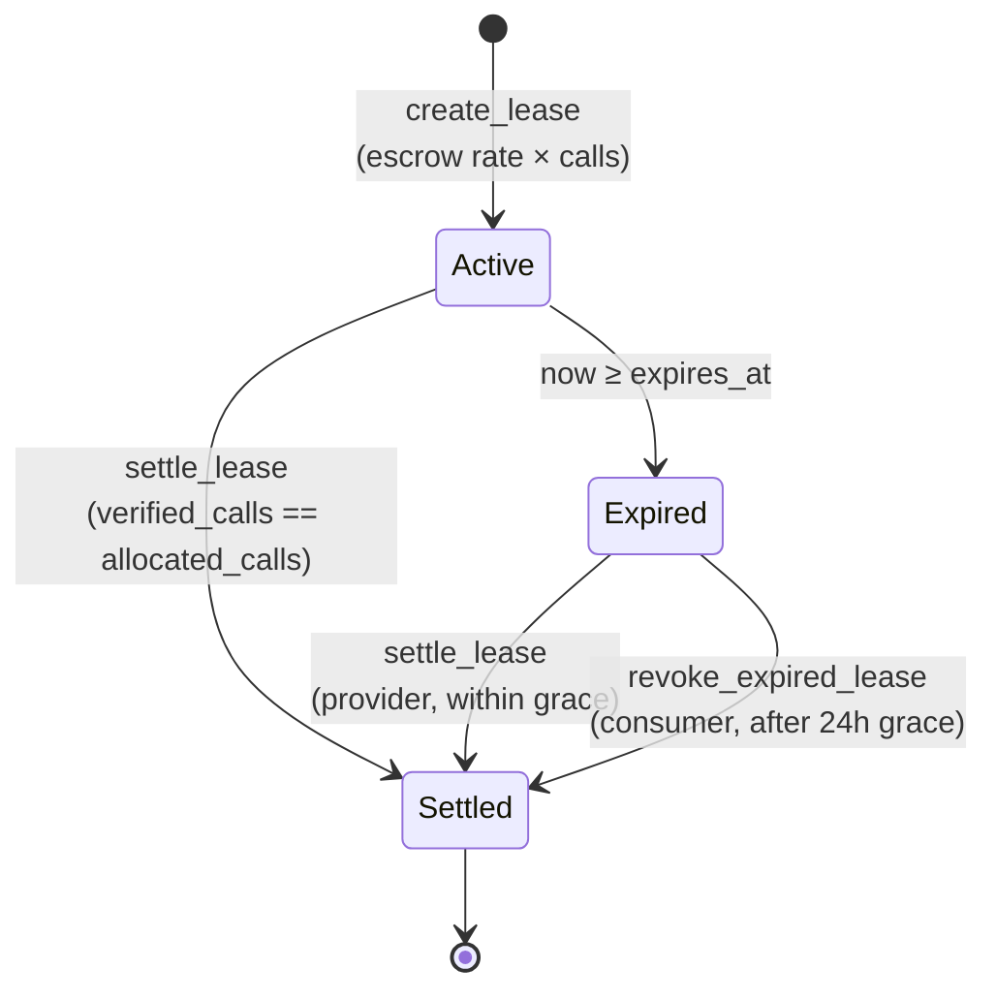

# How the protocol works

## Actors

| Actor | Address | Can do |
| --- | --- | --- |
| **Admin** | one address | `init` once, then `set_token`. Cannot move escrowed funds. |
| **Provider** | per service | Register/update services, settle leases it owns. |
| **Consumer** | per lease | Create leases, revoke expired unsettled leases. |

The admin is a deployment role. It can point the registry at a token address, and
nothing else. It has no path to user funds.

## State

### Service

```rust
pub struct Service {
    pub service_id: u64,
    pub provider: Address,
    pub rate_per_call: i128,   // smallest unit of the escrow token
    pub is_active: bool,
    pub endpoint_hash: BytesN<32>,
}
```

A service is *not* an endpoint URL and *not* a credential. It is a price and a
commitment. `endpoint_hash` is a 32-byte digest of the provider's off-chain
descriptor, so the on-chain record proves what the endpoint *should* be without
publishing anything secret.

### Lease

```rust
pub struct Lease {
    pub lease_id: u64,
    pub service_id: u64,
    pub consumer: Address,
    pub allocated_calls: u32,
    pub used_calls: u32,
    pub expires_at: u64,       // unix seconds, ledger time
    pub locked_deposit: i128,  // rate_per_call * allocated_calls
    pub settled: bool,
}
```

## Lifecycle



`lease_status` derives the state from `settled` and `expires_at`:

| Status | Discriminant | Condition |
| --- | --- | --- |
| `Active` | `0` | not settled, `now < expires_at` |
| `Expired` | `1` | not settled, `now ≥ expires_at` |
| `Settled` | `2` | `settled == true` |

Discriminants are **stable on the wire**. They will never be renumbered.

### When can a lease be settled?

`settle_lease` reverts with `LeaseNotSettleable` unless **either**:

- the lease has expired (`now ≥ expires_at`), **or**
- `verified_calls == allocated_calls`.

The second clause is the "consumer got what it paid for" fast path: if every
allocated call was consumed, the provider should not have to wait for expiry to
be paid.

### The 24-hour grace window

After expiry there is a 24-hour window (`SETTLE_GRACE_PERIOD_SECS = 86_400`)
during which **only the provider** can settle. Once it elapses, the consumer may
call `revoke_expired_lease` and reclaim the entire deposit.

```
expires_at ────────────────────┬─────────────────────────────┬──────────────▶ time
                               │                             │
                        expiry reached              expires_at + 24h
                               │                             │
        provider may settle for the whole window    consumer may revoke
                               │                             │
                        ───────┴──── provider grace ─────────┘
```

Why a grace window at all? Without it, a provider that was offline for a minute
at expiry would lose a legitimate payout to a consumer racing to revoke. The
window gives providers a guaranteed settlement period while keeping the
consumer's exit bounded at 24 hours.

## Worked economics

All figures use the escrow token's smallest unit (7 decimals for the native
asset, so `1 XLM = 10_000_000`).

Suppose a provider registers a service at `rate_per_call = 1_000_000` (0.1 XLM
per call), and a consumer buys 500 calls for 1 hour.

**1. `create_lease`**

```
required_deposit = rate_per_call × requested_calls
                 = 1_000_000 × 500
                 = 500_000_000        (50 XLM)
```

The registry transfers `500_000_000` from the consumer into escrow and sets
`expires_at = now + 3600`.

**2a. `settle_lease` after 1 hour with 320 calls consumed**

```
payout = 1_000_000 × 320 = 320_000_000   (32 XLM to the provider)
refund = 500_000_000 − 320_000_000
       = 180_000_000                     (18 XLM back to the consumer)
```

**2b. Provider goes dark; consumer calls `revoke_expired_lease` after 24h**

```
refund = locked_deposit = 500_000_000    (50 XLM, the full deposit)
```

**2c. Consumer burns all 500 calls in 10 minutes**

`settle_lease` is immediately allowed (`verified_calls == allocated_calls`):

```
payout = 1_000_000 × 500 = 500_000_000   (50 XLM)
refund = 0
```

### Cost of the lease itself

Creating a lease costs one Soroban transaction (fees plus the escrow transfer).
Settlement costs one more. There is no per-call on-chain cost — the provider
settles with a single call count, which is what makes this cheap enough for
small allotments.

## Invariants

These must hold for every reachable state. They are asserted in tests.

1. **Conservation.** For every lease, `payout + refund == locked_deposit`.
2. **Single release.** A settled lease can never be settled or revoked again
   (`LeaseAlreadySettled`).
3. **Bounded claim.** A provider can never receive more than
   `allocated_calls × rate_per_call`, and only for a service it owns.
4. **Guaranteed exit.** Every lease has a consumer path to a full refund.
5. **Checked math.** Deposit, payout and timestamp arithmetic abort on overflow
   rather than truncating.

## Storage and lifetime

| Key | Storage | Notes |
| --- | --- | --- |
| `Admin`, `Token` | instance | configuration; instance TTL is bumped on every state change |
| `ServiceCount`, `LeaseCount` | instance | monotonic id counters |
| `Service(u64)` | persistent | TTL extended on save and on read |
| `Lease(u64)` | persistent | TTL extended on save and on read |

`LEDGER_BUMP_THRESHOLD = 17_280` ledgers (~1 day at 5s ledgers) and
`LEDGER_BUMP_EXTEND = 518_400` ledgers (~30 days). Reads re-extend the TTL, so an
actively-read lease stays alive; the safe upper bound on `duration_secs` for a
lease nobody reads is tracked as a `wave-high` issue.

## Read next

- [Contract reference](contract-reference.md) — every entry point, parameter and error.
- [Security model](security.md) — the trust assumptions behind these invariants.
