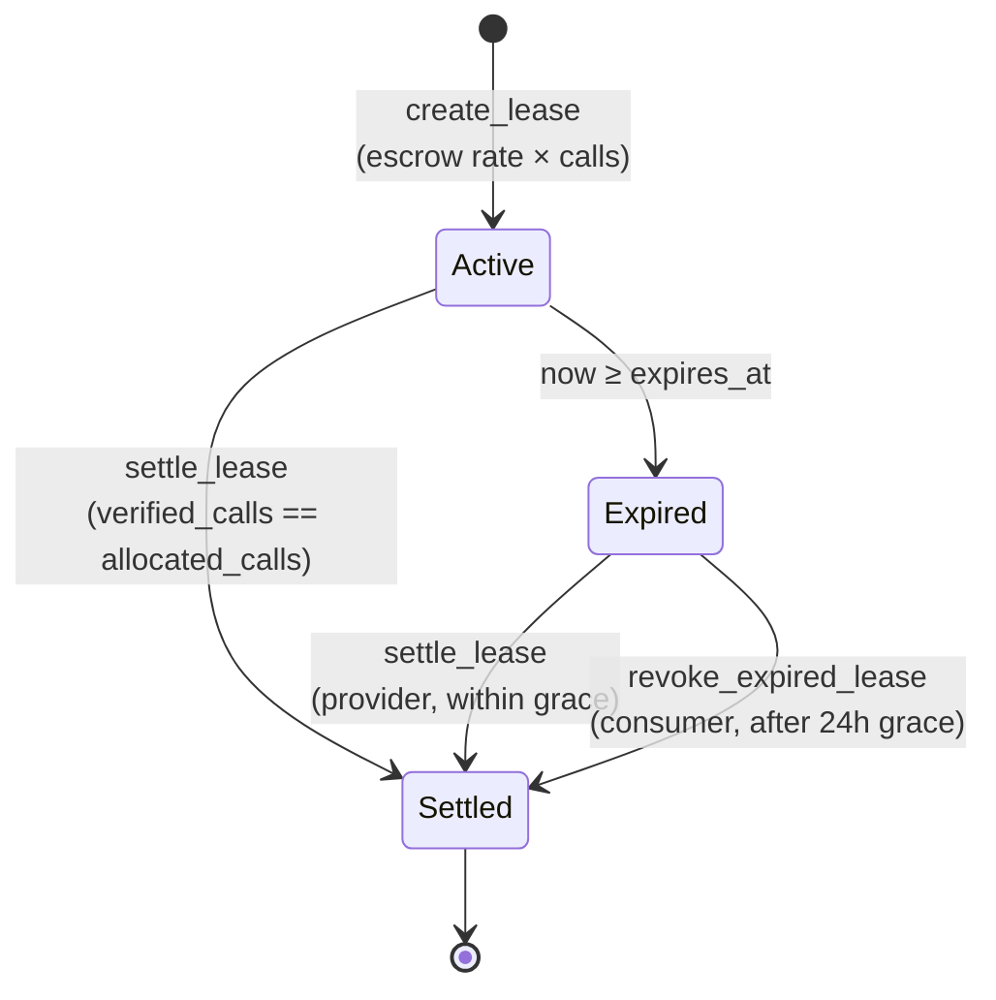

# How the protocol works

## Actors

| Actor | Address | Can do |
| --- | --- | --- |
| **Admin** | one Stellar account | `init` once, `set_token`, `upgrade`. Cannot move escrowed funds. |
| **Provider** | per service (account or contract address) | Register/pause services, settle leases it owns. |
| **Consumer** | per lease (account or contract address) | Create leases, revoke expired unsettled leases. |

The admin is a deployment role. It can point the registry at a token address and
install a new Wasm, and nothing else. It has no path to user funds.

Because every actor is a Soroban `Address`, the same protocol works for classic
Stellar accounts (`G…`), multisig accounts and smart contracts (`C…`).

## State

### Service

```rust
pub struct Service {
    pub service_id: u64,
    pub provider: Address,
    pub rate_per_call: i128,   // smallest unit of the escrow token
    pub is_active: bool,
    pub endpoint_hash: BytesN<32>,
}
```

A service is *not* an endpoint URL and *not* a credential. It is a price and a
commitment. `endpoint_hash` is a 32-byte digest of the provider's off-chain
descriptor, so the on-chain record proves what the endpoint *should* be without
publishing anything secret.

### Lease

```rust
pub struct Lease {
    pub lease_id: u64,
    pub service_id: u64,
    pub consumer: Address,
    pub allocated_calls: u32,
    pub used_calls: u32,
    pub expires_at: u64,       // unix seconds, ledger time
    pub locked_deposit: i128,  // rate_per_call * allocated_calls
    pub settled: bool,
}
```

## Lifecycle


```mermaid
stateDiagram-v2
    [*] --> Active: create_lease<br/>(escrow rate × calls)
    Active --> Expired: now ≥ expires_at
    Active --> Settled: settle_lease<br/>(verified_calls == allocated_calls)
    Expired --> Settled: settle_lease<br/>(provider, within grace)
    Expired --> Settled: revoke_expired_lease<br/>(consumer, after 24h grace)
    Settled --> [*]
```

`lease_status` derives the state from `settled` and `expires_at`:

| Status | Discriminant | Condition |
| --- | --- | --- |
| `Active` | `0` | not settled, `now < expires_at` |
| `Expired` | `1` | not settled, `now ≥ expires_at` |
| `Settled` | `2` | `settled == true` |

Discriminants are **stable on the wire**. They will never be renumbered.

### `Settled` is one state, reached two ways

`settled` records that escrow has left the contract — it does not record *why*.
Both terminal transitions set it: `settle_lease` after paying the provider, and
`revoke_expired_lease` after refunding the consumer in full. So `Settled` is the
answer to "is this lease finished?", never to "did the provider earn?", and
`Error::LeaseAlreadySettled` (7) likewise means "already settled or revoked".

The two paths are separable, but not from the status:

- `used_calls` is written only by `settle_lease`, so `settled && used_calls > 0`
  is a provider settlement.
- `settled && used_calls == 0` is ambiguous: a revocation, **or** a settlement
  reported with `verified_calls = 0`, which is the provider's legitimate way of
  refunding a lease it could not serve. The two leave identical storage.
- The published event is the only discriminator — `lease_settled` versus
  `lease_revoked` for that `lease_id`.

| Lifecycle event | `settled` | `used_calls` | `lease_status` |
| --- | --- | --- | --- |
| `create_lease` | `false` | `0` | `Active` |
| `settle_lease(320)` of 500, after expiry | `true` | `320` | `Settled` |
| `settle_lease(0)` of 500, after expiry | `true` | `0` | `Settled` |
| `revoke_expired_lease` after the grace window | `true` | `0` | `Settled` |

The full state-by-event table, including `remaining_calls` and
`locked_balance`, is in
[`LeaseStatus` and the `settled` flag](contract-reference.md#leasestatus-and-the-settled-flag),
and how to consume the two events is in
[Following the event stream](integration.md#following-the-event-stream).

### When can a lease be settled?

`settle_lease` reverts with `LeaseNotSettleable` unless **either**:

- the lease has expired (`now ≥ expires_at`), **or**
- `verified_calls == allocated_calls`.

The second clause is the "consumer got what it paid for" fast path: if every
allocated call was consumed, the provider should not have to wait for expiry to
be paid.

### The 24-hour grace window

After expiry there is a 24-hour window (`SETTLE_GRACE_PERIOD_SECS = 86_400`)
during which **only the provider** can settle. Once it elapses, the consumer may
call `revoke_expired_lease` and reclaim the entire deposit.

```text
expires_at ────────────────────┬─────────────────────────────┬──────────────▶ time
                               │                             │
                        expiry reached              expires_at + 24h
                               │                             │
        provider may settle for the whole window    consumer may revoke
                               │                             │
                        ───────┴──── provider grace ─────────┘
```

Why a grace window at all? Without it, a provider that was offline for a minute
at expiry would lose a legitimate payout to a consumer racing to revoke. The
window gives providers a guaranteed settlement period while keeping the
consumer's exit bounded at 24 hours.

## Events

Every transition publishes a typed Soroban event. Event names are the first
topic, followed by the id fields marked `#[topic]`; the payload is a map of the
remaining fields. Each payload also carries `schema_version`, so a stream that
spans a contract upgrade stays decodable (see
[Integration → Event schema version](integration.md#event-schema-version)).

| Event | Topics | Data |
| --- | --- | --- |
| `registry_initialized` | — | `schema_version`, `admin` |
| `escrow_token_set` | — | `schema_version`, `admin`, `token` |
| `service_registered` | `service_id` | `schema_version`, `provider`, `rate_per_call`, `endpoint_hash` |
| `service_status_changed` | `service_id` | `schema_version`, `provider`, `is_active` |
| `lease_created` | `lease_id` | `schema_version`, `service_id`, `consumer`, `allocated_calls`, `expires_at`, `locked_deposit` |
| `lease_settled` | `lease_id` | `schema_version`, `provider`, `verified_calls`, `payout`, `refund` |
| `lease_revoked` | `lease_id` | `schema_version`, `consumer`, `refund` |
| `contract_upgraded` | — | `schema_version`, `admin`, `new_wasm_hash` |

Events are the indexing contract between on-chain state and off-chain systems: a
provider can settle from a projection built by subscribing to `lease_created`,
and accounting can reconcile payouts from `lease_settled` without polling every
lease. See [Integration](integration.md).

## Worked economics

All figures use the escrow token's smallest unit (7 decimals for the native
asset, so `1 XLM = 10_000_000`).

Suppose a provider registers a service at `rate_per_call = 1_000_000` (0.1 XLM
per call), and a consumer buys 500 calls for 1 hour.

**1. `create_lease`**

```text
required_deposit = rate_per_call × requested_calls
                 = 1_000_000 × 500
                 = 500_000_000        (50 XLM)
```

The registry transfers `500_000_000` from the consumer into escrow and sets
`expires_at = now + 3600`.

**2a. `settle_lease` after 1 hour with 320 calls consumed**

```text
payout = 1_000_000 × 320 = 320_000_000   (32 XLM to the provider)
refund = 500_000_000 − 320_000_000
       = 180_000_000                     (18 XLM back to the consumer)
```

**2b. Provider goes dark; consumer calls `revoke_expired_lease` after 24h**

```text
refund = locked_deposit = 500_000_000    (50 XLM, the full deposit)
```

**2c. Consumer burns all 500 calls in 10 minutes**

`settle_lease` is immediately allowed (`verified_calls == allocated_calls`):

```text
payout = 1_000_000 × 500 = 500_000_000   (50 XLM)
refund = 0
```

### What a lease costs

Three different things are paid for when a lease is taken, and only one of them
comes back. The table below holds the allotment fixed at the worked example —
500 calls at `rate_per_call = 1_000_000` — and changes only the duration.

| Lease shape | `duration_secs` | Deposit in escrow | TTL the contract asks for | Effective life on Testnet |
| --- | --- | --- | --- | --- |
| Short — 1 hour | `3_600` | `500_000_000` (50 XLM) | 35,280 ledgers | 120,960 (the network floor, ≈7 days) |
| Medium — 1 day | `86_400` | `500_000_000` (50 XLM) | 51,840 ledgers | 120,960 (the network floor, ≈7 days) |
| Long — 7 days | `604_800` | `500_000_000` (50 XLM) | 155,520 ledgers | 155,520 (≈9 days) |
| Longest — 30 days | `2_592_000` | `500_000_000` (50 XLM) | 552,960 ledgers | 552,960 (≈32 days) |

**The deposit column never moves.** The deposit is `rate_per_call ×
requested_calls`, and `duration_secs` does not appear in it: the same 500 calls
cost the same 50 XLM whether the window is an hour or a month, and they are
refundable in exactly the same proportions. The deposit is only bounded above, by
`MAX_LEASE_DEPOSIT = 1_000_000_000_000` base units — two thousand times the
example above — so an ordinary lease never meets the cap.

**Duration changes the rent line.** `save_lease` extends the lease entry for its
remaining term, the 24-hour settlement grace window and a one-day read buffer,
which is the `lease_ttl_extend` column. At creation the remaining term is the whole
duration, so the ask is `(duration + 86_400) / 5 + 17_280` ledgers, clamped to
`min(MAX_ENTRY_TTL_LEDGERS, network maxEntryTtl)`. The clamp never binds a legal
lease: the longest one asks for 552,960 ledgers against a 1,555,200-ledger ceiling.
The first two rows land under the Testnet minimum persistent TTL, so an hour and a
day cost the same here — buying a longer window only starts to cost more once it
exceeds the floor.

Bumping a lease *later* is a smaller ask, because the same formula is applied to the
time still remaining rather than to the original term; see
[`bump_lease`](contract-reference.md#bump_lease).

**Counting transactions.** A normal lifecycle is two of them: `create_lease` and
`settle_lease`. The refund path is also two: `create_lease` and
`revoke_expired_lease`. There is no per-call transaction — the provider settles
with a single `verified_calls` figure, which is what makes small allotments
worthwhile.

### Which of those costs come back

| Cost | Paid by | Paid when | Refundable |
| --- | --- | --- | --- |
| Token deposit | consumer | `create_lease` | Partly: `locked_deposit − payout` on settlement, `payout` being what the provider actually served |
| Token deposit, undisbursed | consumer | `create_lease` | Fully, 100%: on `revoke_expired_lease` after the grace window, and on a settlement with `verified_calls = 0` |
| Soroban transaction fee | whoever sends the call | every transaction | No. It pays for block space and goes to the network |
| Soroban storage rent | whoever makes the write that extends the entry | `create_lease`, then again at settle or revoke | No, and it is prepaid. Settling an hour into a thirty-day lease does not refund the ledgers you will never use |

So the consumer's token exposure is always reversible — the protocol's whole
point — while the network's fees are spent the moment the transaction lands.
Rent is charged again at settlement because settling rewrites the lease entry,
which is one reason the provider, not the consumer, is expected to call it.

### What this page will not tell you

Rent in XLM is not a contract constant. It is the entry's byte size times the
number of ledgers it is kept alive, times a per-ledger price the *network*
sets, and that price differs between Testnet and mainnet. The only figures in
this repository that were actually measured are the Testnet ones in
[deployments](deployments.md#deployment-economics-testnet), and they include a
minimum-TTL floor that mainnet does not share. Size a real allotment against the
fees of the network you deploy to — `stellar network settings`, or your RPC
provider — before quoting a per-call price.

## Invariants

These must hold for every reachable state. They are asserted in tests.

1. **Conservation.** For every lease, `payout + refund == locked_deposit`.
2. **Single release.** A settled lease can never be settled or revoked again
   (`LeaseAlreadySettled`), and `settled` is persisted before any token call.
3. **Bounded claim.** A provider can never receive more than
   `allocated_calls × rate_per_call`, and only for a service it owns.
4. **Guaranteed exit.** Every lease has a consumer path to a full refund.
5. **Checked math.** Deposit, payout and timestamp arithmetic abort on overflow
   rather than truncating.
6. **Claimable storage.** A lease's persistent entry outlives its term plus the
   grace window (`MAX_LEASE_DURATION_SECS = 30 days`).

## Storage and lifetime

| Key | Storage | Notes |
| --- | --- | --- |
| `Admin`, `Token` | instance | configuration; instance TTL is bumped on every state change |
| `ServiceCount`, `LeaseCount` | instance | monotonic id counters |
| `Service(u64)` | persistent | TTL extended on save and by `bump_service` |
| `Lease(u64)` | persistent | TTL extended on save and by `bump_lease`, never by a read |
| `ProviderServices(Address)` | persistent | service-id index per provider; extended by `save_service`, never by a read |

`LEDGER_BUMP_THRESHOLD = 17_280` ledgers (~1 day at 5s ledgers) and
`LEDGER_BUMP_EXTEND = 518_400` ledgers (~30 days). For leases, `save_lease` and
`bump_lease` extend to `(expires_at − now + 24h) / 5s + LEDGER_BUMP_THRESHOLD`
ledgers, so the escrow stays claimable for the whole lease, the provider's grace
window and a one-day read buffer — without paying rent for unused storage time.
Once a lease is past its term and grace window that ask settles at about two
days, so keeping a dead lease alive costs rent per bump rather than per month.

Rent scales with that ask: at the ledger where an extension is due, `bump_lease`
estimates 48,684 stroops of persistent rent for a 30-day-term lease against zero
for `get_lease`, which is why reads do not extend. `MAX_ENTRY_TTL_LEDGERS`
(1,555,200 ledgers ≈ 90 days) caps any single extension, and the cap is also
taken against the network's live `maxEntryTtl`, so an entry's horizon is never
derived from stored `expires_at` alone.

### The provider index

`ProviderServices(provider)` holds that provider's `service_id`s, oldest first.
Its lifetime rules are the service rules, not a new third policy:

- **Written with the record.** `save_service` appends to the index and extends it
  in the same step it stores the `Service`, with the same clamped horizon, so an
  entry and the index row that points at it cannot drift apart in rent terms.
- **Refreshed by any write to the catalogue, not by reading it.** `save_service`
  also runs on `set_service_active`, whose id is already in the index, so pausing
  or resuming one service keeps the whole catalogue alive. Nothing on the read path
  extends anything, this entry included — see the module doc in
  `contracts/registry/src/storage.rs` for the rent measurement behind that rule.
- **Never bumped for the listed services.** Paging reads each `Service` record to
  re-check ownership but does not extend it: a page is a discovery read over
  entries somebody else owns, so their rent stays with their owner. A caller
  cannot keep another provider's records alive, nor evict them.
- **Append-only, pruned on read.** The index is derived state; `Service.provider`
  is the authority. If a service is later transferred, its id stays in the old
  owner's row and the read path drops it, while `save_service` puts it in the new
  owner's row. An index can therefore only ever make a page shorter — never
  disclose a service that belongs to someone else. The stale id costs one ledger
  read to skip, and a provider that re-registers does not duplicate it.

If the index entry expires while its services live on, the provider's pages go
empty until the next write to any of its services recreates the row. That is a
discovery-availability failure, not a loss of funds or of ownership, which is why
the index is safe to treat as cache. `bump_service` does not refresh it: that call
takes a `service_id` and extends one record without loading it, and finding the
index key means reading the record — the cost it exists to avoid. A provider that
needs a durable index across months of inactivity is the case an explicit index
bump would serve, and it is not implemented here.

## Read next

- [Contract reference](contract-reference.md) — every entry point, parameter and error.
- [Security model](security.md) — the trust assumptions behind these invariants.
